# iOS Apps

**Fibra**

**Project Overview**

Fibra is a mobile application designed to streamline the process of managing receipts from a specific store. By generating a unique user code for each customer, the app allows users to receive their receipts digitally and get notified instantly when a new receipt is added to their collection. This innovative approach not only declutters physical storage but also promotes an eco-friendly, paperless environment.

**Project Goal**

Enhance User Convenience: Simplify the receipt management process for users, eliminating the need to keep physical receipts.
Promote Eco-Friendly Practices: Encourage the use of digital receipts to reduce paper waste.
Ensure Data Security: Provide a secure platform for users to store and access their receipts.
Improve Store-Customer Interaction: Facilitate seamless communication between the store and customers through instant receipt notifications.

**Tech Used**

- Swift UIKit 
- RESTful API’s
- Push Notification
- Firebase

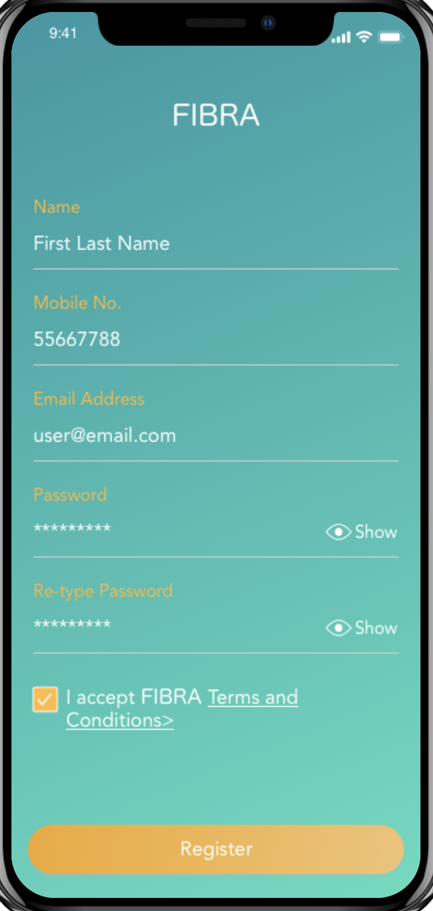  |  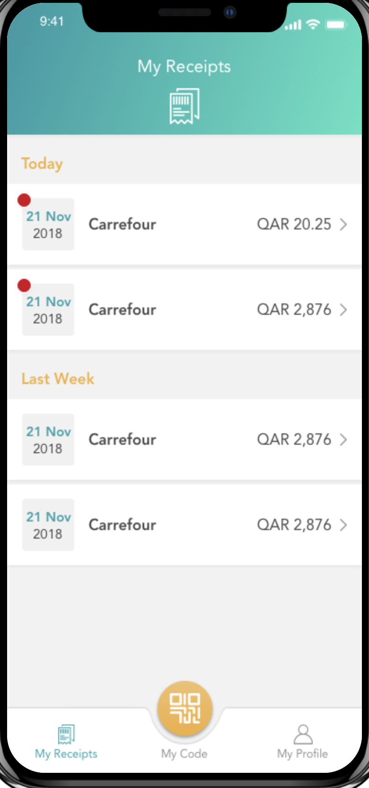  |  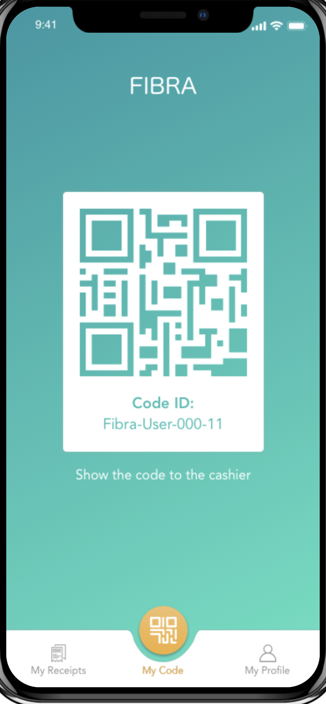  |     

**Trough**

**Project Overview**

Trough is an iOS application designed to enhance social gatherings by integrating event planning, food truck booking, and advanced menu ordering capabilities. The app allows users to create events, invite friends, and seamlessly book food trucks to cater those events. Users can pre-order from the food truck's menu in advance or place orders during the event. Additionally, Trough enables users to interact socially by liking and commenting on events created by friends. The app also maintains a comprehensive history of past events and food orders for reference.

For food enthusiasts looking beyond events, Trough provides a feature-rich platform to discover local food trucks, explore their menus, and place orders directly without organizing an event.

**Project Goal**

The goal of the Trough app is to provide a comprehensive solution for event planning, food truck booking, and menu ordering while fostering social interaction among users. Key objectives include:

Enable users to create events and invite friends from within the app.
Facilitate easy event planning and management with intuitive controls.

Integrate a directory of local food trucks for users to browse and select.
Allow users to book a food truck for their event directly through the app.

Provide users with the ability to view food truck menus and place orders in advance or during the event.
Ensure smooth transactions and real-time updates on order status.

Enable users to like and comment on events created by their friends.
Foster community engagement through interactive event features.

Maintain a record of past events and food orders for users to reference.
Offer insights into previous interactions and preferences.

Developed a dedicated version of the app for food truck drivers.
Notify drivers of incoming orders, event invitations, and order management tools.
Provide a clear view of current and previous orders, payments, and event details.
By achieving these goals, Trough aims to streamline the process of event planning and food truck booking while enriching social experiences and supporting local food vendors. The app seeks to become a go-to platform for both users hosting events and those seeking unique culinary experiences from food trucks in their area.

**Tech Used**

- Swift UIKit 
- RESTful API’s
- Push Notification
- Firebase
- Google Maps
- Stripe
- Animations
- Third-party login

  |    |  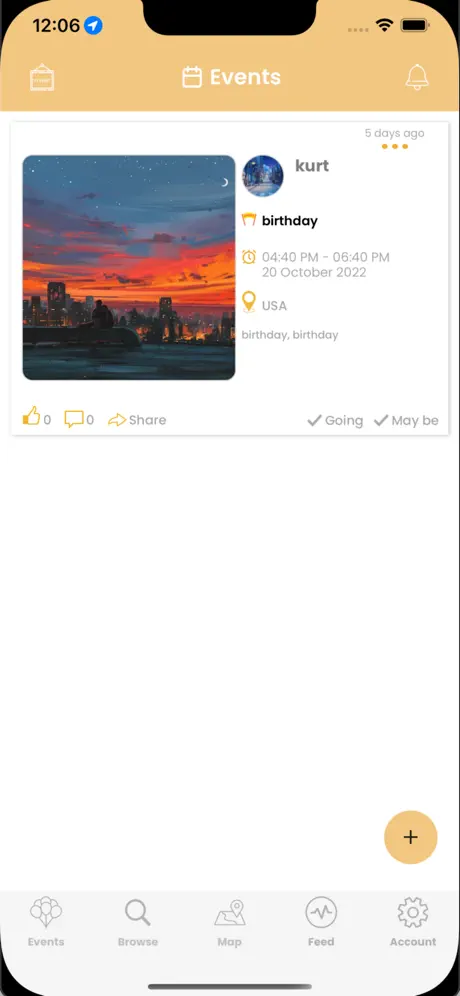  |  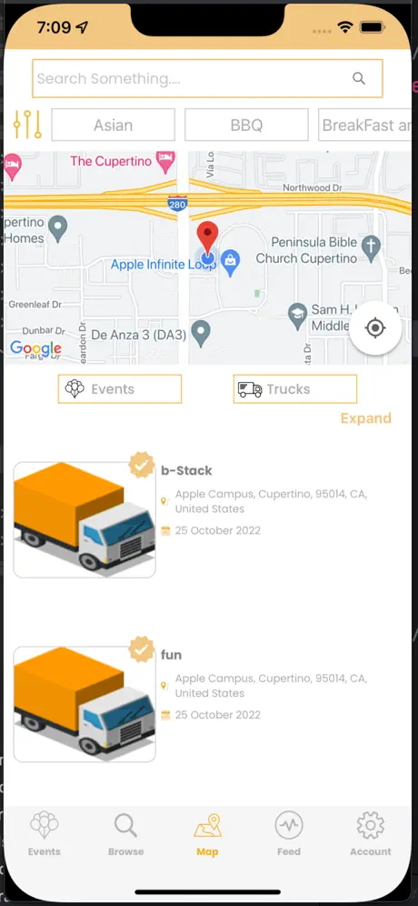  |  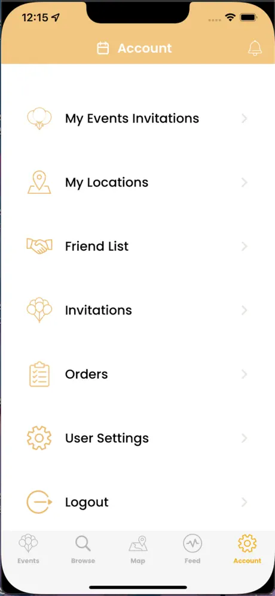

**Intely Health**

**Project Overview**

Intely Health is an iOS application designed to streamline the healthcare experience by connecting patients with doctors for virtual appointments. The platform caters to both patients seeking medical advice and doctors offering their services through a user-friendly interface. Key functionalities include appointment booking, video consultations, secure messaging, health data management, and subscription management for families.

**Project Goal**

The goal of Intely Health is to provide a comprehensive digital healthcare solution that enhances accessibility, convenience, and efficiency for both patients and doctors. By leveraging technology, the app aims that:

Patients can browse doctor profiles, view their specialties, and book appointments based on availability.
Doctors can create and manage appointment slots, view their schedules, and handle patient bookings.

Patients and doctors can conduct secure video calls directly within the app after booking appointments.
During video calls, doctors can take SOAP notes, record vitals, and manage appointment-specific details.

Secure messaging allows patients and doctors to communicate post-appointment for follow-ups and queries.
Doctors can create blogs, share educational content, and send emails with attachments to patients and colleagues.

Patients are required to input personal and medical information, including lab results, prior to booking appointments.
A user-friendly interface allows patients to manage health records and access interactive tools like an Anatomy system to pinpoint areas of concern.

Patients can purchase subscriptions to manage appointments for themselves and multiple family members under one account.
Family members can utilize the app individually while sharing subscription benefits.

Patients can read blogs and articles authored by doctors within the app, enhancing health literacy and promoting proactive healthcare.

Doctors can showcase their experience, achievements, specialties, and professional credentials to establish credibility among patients.
Intely Health aims to revolutionize healthcare delivery by bridging the gap between patients and doctors through intuitive digital interactions, ensuring personalized care, and fostering a proactive approach to health management.

**Tech Used**
- Swift UIKit 
- RESTful API’s
- Push Notification
- Firebase
- Socket.IO
- OpenTok
- Stripe
- Interactive Human Anatomy

  
  
  
  

  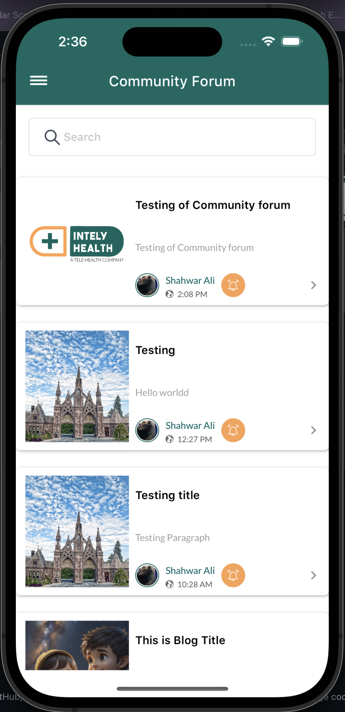
  
  
  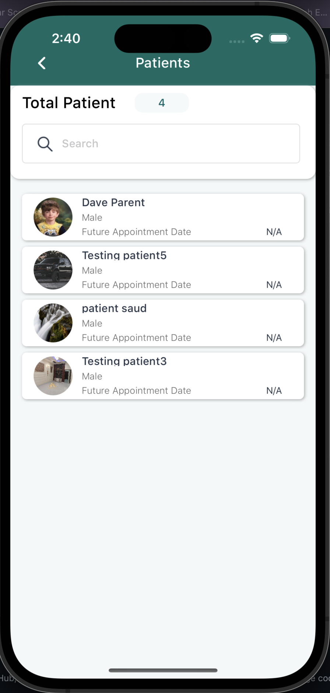

***Medical Ai***

**Project Overview**

Medical Ai is an advanced iOS application designed to enhance the healthcare experience for both patients and doctors through the use of artificial intelligence. The app offers a comprehensive suite of features that facilitate appointment management, virtual consultations, patient-doctor communication, and AI-driven medical advice. The platform is divided into two main interfaces: one for doctors and one for patients, each tailored to their specific needs and functionalities.

**Project Goal**

Project Overview: Medical Ai
Medical Ai is an advanced iOS application designed to enhance the healthcare experience for both patients and doctors through the use of artificial intelligence. The app offers a comprehensive suite of features that facilitate appointment management, virtual consultations, patient-doctor communication, and AI-driven medical advice. The platform is divided into two main interfaces: one for doctors and one for patients, each tailored to their specific needs and functionalities.

Project Goal:
The goal of Medical Ai is to provide a state-of-the-art digital healthcare solution that leverages artificial intelligence to improve accessibility, efficiency, and quality of care for patients and doctors. Key objectives include:

Doctors: Manage patient information, appointment slots, earnings, and communications efficiently through an intuitive dashboard. The app allows doctors to document appointment details, SOAP notes, and vitals during video calls.
Patients: Easily book appointments, manage personal and medical information, and track their healthcare interactions through a user-friendly interface.

Enable patients and doctors to conduct secure video consultations, ensuring timely and accessible medical care.
Allow doctors to add notes and vital records during consultations, ensuring comprehensive documentation.

AI Chatbot: Provide patients with instant access to a general physician AI chatbot for preliminary medical advice, reducing the need for immediate appointments.
Allow patients to read doctor-created blogs and access educational content within the app.

Patients can input and manage their personal and medical information, including lab results, ensuring that doctors have all necessary data for accurate diagnosis and treatment.
Doctors can create detailed profiles showcasing their experience, achievements, and specialties to build trust and credibility.

Provide doctors with analytics on total patients, earnings, and appointment statistics to help them manage their practice effectively.
Offer patients insights into their appointment history and health metrics, promoting proactive health management.

By integrating AI-driven features and user-centric design, Medical Ai aims to revolutionize the way healthcare is delivered and managed, ensuring a seamless, efficient, and accessible experience for both patients and doctors.

**Tech Used**

- Swift UIKit 
- RESTful API’s
- Push Notification
- Firebase
- Socket.IO
- OpenTok
- Stripe
- DGCharts

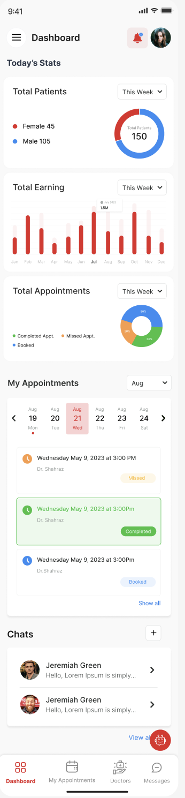 |  | 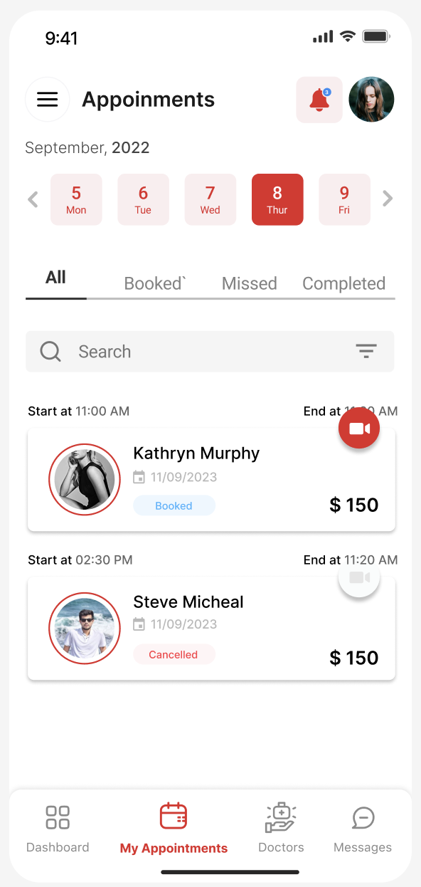 | 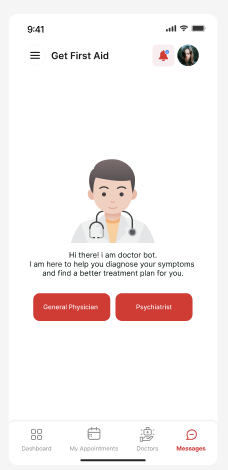 | 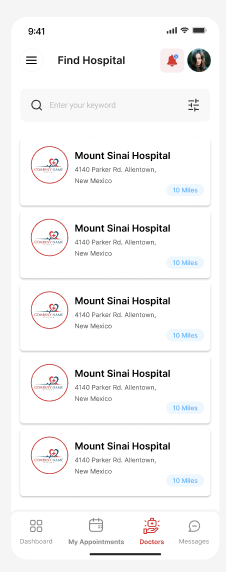
