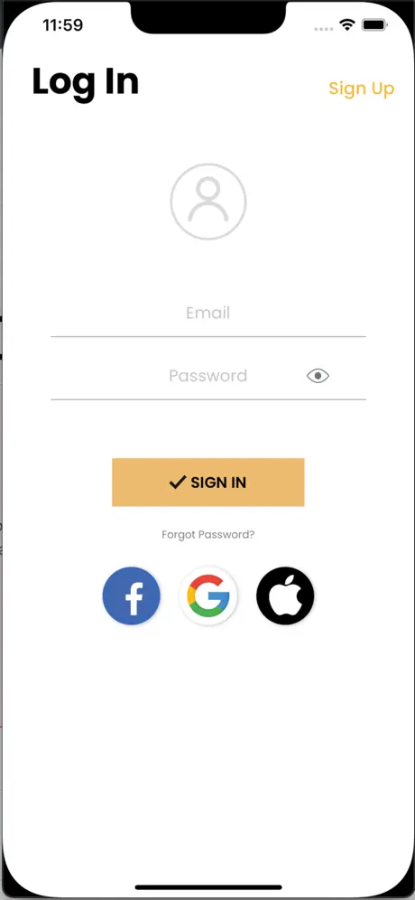

# iOS Apps

Fibra

**Project Overview**

Fibra is a mobile application designed to streamline the process of managing receipts from a specific store. By generating a unique user code for each customer, the app allows users to receive their receipts digitally and get notified instantly when a new receipt is added to their collection. This innovative approach not only declutters physical storage but also promotes an eco-friendly, paperless environment.

**Project Goal**

Enhance User Convenience: Simplify the receipt management process for users, eliminating the need to keep physical receipts.
Promote Eco-Friendly Practices: Encourage the use of digital receipts to reduce paper waste.
Ensure Data Security: Provide a secure platform for users to store and access their receipts.
Improve Store-Customer Interaction: Facilitate seamless communication between the store and customers through instant receipt notifications.

**Tech Used**

- Swift UIKit 
- RESTful API’s
- Push Notification
- Firebase

  |       
 
  |     

Trough

**Project Overview**

Trough is an iOS application designed to enhance social gatherings by integrating event planning, food truck booking, and advanced menu ordering capabilities. The app allows users to create events, invite friends, and seamlessly book food trucks to cater those events. Users can pre-order from the food truck's menu in advance or place orders during the event. Additionally, Trough enables users to interact socially by liking and commenting on events created by friends. The app also maintains a comprehensive history of past events and food orders for reference.

For food enthusiasts looking beyond events, Trough provides a feature-rich platform to discover local food trucks, explore their menus, and place orders directly without organizing an event.

**Project Goal**

The goal of the Trough app is to provide a comprehensive solution for event planning, food truck booking, and menu ordering while fostering social interaction among users. Key objectives include:

*Seamless Event Management:

Enable users to create events and invite friends from within the app.
Facilitate easy event planning and management with intuitive controls.

*Efficient Food Truck Booking:

Integrate a directory of local food trucks for users to browse and select.
Allow users to book a food truck for their event directly through the app.

*Advanced Menu Ordering:

Provide users with the ability to view food truck menus and place orders in advance or during the event.
Ensure smooth transactions and real-time updates on order status.

*Social Interaction Features:

Enable users to like and comment on events created by their friends.
Foster community engagement through interactive event features.

*Comprehensive History Tracking:

Maintain a record of past events and food orders for users to reference.
Offer insights into previous interactions and preferences.

*Enhanced User Experience for Drivers:

Develop a dedicated version of the app for food truck drivers.
Notify drivers of incoming orders, event invitations, and order management tools.
Provide a clear view of current and previous orders, payments, and event details.
By achieving these goals, Trough aims to streamline the process of event planning and food truck booking while enriching social experiences and supporting local food vendors. The app seeks to become a go-to platform for both users hosting events and those seeking unique culinary experiences from food trucks in their area.

**Tech Used**

- Swift UIKit 
- RESTful API’s
- Push Notification
- Firebase
- Google Maps

  |    |       

  |     
